# torch2rtl

**Demo: compile a fixed quantized MLP to a custom SIMD GPU, verify it in RTL, and run synthesis + CTS + route on GPDK045.**

This repo contains a 4-lane SIMD GPU written in synthesizable Verilog, a narrow model-to-assembly compiler, an assembler, and self-checking testbenches. The checked-in proof artifacts show a quantized `16 -> 16 -> 4` MLP running end to end in RTL, plus measured backend results from Genus, Innovus, PrimeTime extracted post-route STA, and Pegasus on CMC Cloud.

## Pipeline

<p align="center">
  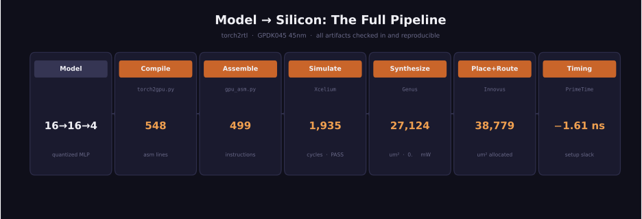
</p>

## Measured Results

All numbers below come from checked-in run artifacts under `docs/vector_reports/` and `docs/scalar_reports/`. See `docs/benchmark.md` for extraction details, formulas, and exact source files.

### 4-Lane SIMD Target

| Metric | Value |
|--------|------:|
| Genus total cell area | `27123.678 um^2` |
| Innovus placed cell area | `27181.818 um^2` |
| Worst setup slack | `-1.61 ns` |
| Worst hold slack | `0.32 ns` |
| Derived max frequency | `86.13 MHz` |
| Genus power | `0.707748 mW` |
| Fetched instructions | `482` |
| RTL cycles per inference | `1935` |
| Inference latency | `22.47 us` |
| Energy per inference | `15.90 nJ` |

### SIMD vs Scalar Tradeoff

| Metric | 4-lane SIMD | 1-lane scalar | Takeaway |
|--------|------------:|--------------:|----------|
| Genus total cell area | `27123.678 um^2` | `7430.634 um^2` | Scalar is about `3.7x` smaller |
| Derived max frequency | `86.13 MHz` | `90.99 MHz` | Scalar is about `1.06x` faster under extracted STA |
| Genus power | `0.707748 mW` | `0.181498 mW` | VCD-based power narrows the gap to about `3.9x` |
| Fetched instructions | `482` | `1384` | Scalar fetches about `2.87x` as much work |
| RTL cycles per inference | `1935` | `4129` | SIMD needs about `2.13x` fewer cycles |
| Inference latency | `22.47 us` | `45.38 us` | SIMD still wins on throughput / latency |
| Energy per inference | `15.90 nJ` | `8.24 nJ` | Scalar is about `1.93x` more energy-efficient on this demo |

This is an engineering tradeoff, not a universal SIMD win: the vector core still clears about `2x` lower latency on the checked-in workload, while the scalar core is much smaller and still lower energy.

<p align="center">
  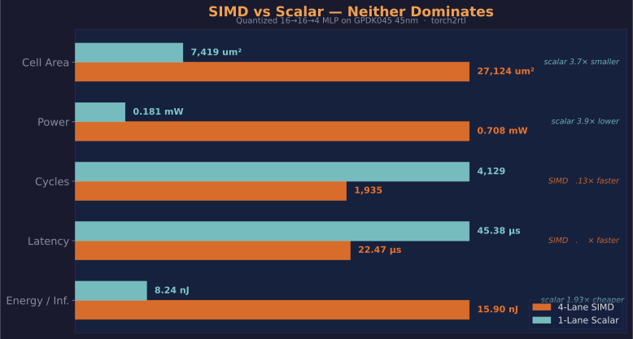
</p>

## What This Proves

- An agent can compile the checked-in quantized MLP demo into this ISA and produce runnable program/data images.
- The compiled program executes correctly in RTL on both the SIMD and scalar variants.
- The GPU RTL can be synthesized, placed, CTS'd, routed, and checked with extracted post-route STA on the CMC/GPDK045 stack.
- The repo produces real, traceable area, timing, and power artifacts from commercial EDA tools.

## What This Does Not Prove

- Production readiness or tapeout readiness.
- Full timing closure or signoff-quality physical closure.
- DRC closure on GPDK045.
- Floating-point support.
- General-purpose model compilation. The validated path is a quantized two-layer MLP compiler for shapes where `inputs` and `hidden` are divisible by `4`; the checked-in demo remains `16 -> 16 -> 4`.

## Scaling

The current compiler generalizes across the checked MLP family where the layer widths stay compatible with 4-lane packing. The measured sweep is checked in at `docs/model_shape_sweep.csv`.

| Model shape | MACs | Vector instructions | Scalar instructions | Vector / Scalar |
|--------|------:|------:|------:|------:|
| `16 -> 16 -> 4` | `320` | `499` | `1401` | `0.356x` |
| `16 -> 32 -> 4` | `640` | `995` | `2793` | `0.356x` |
| `16 -> 64 -> 4` | `1280` | `1987` | `5577` | `0.356x` |

This is evidence that the compiler handles a small family of quantized MLPs where dimensions align with 4-lane SIMD, not a claim of arbitrary PyTorch model support.

## Reproduce From Scratch

These commands regenerate the source artifacts behind the checked-in demo files and benchmark report bundles.

### 1. Compile and assemble

```bash
python3 tools/torch2gpu.py --out-prefix demo/mlp16x16x4
python3 tools/torch2gpu.py --lanes 1 --out-prefix demo/mlp16x16x4_scalar
python3 tools/gpu_asm.py demo/mlp16x16x4.asm -o demo/mlp16x16x4_program.hex
python3 tools/gpu_asm.py demo/mlp16x16x4_scalar.asm -o demo/mlp16x16x4_scalar_program.hex
```

### 2. Simulate

```bash
tcsh -c 'source /CMC/scripts/cadence.xceliummain25.09.001.csh && \
  xrun -64bit -access +rwc -timescale 1ns/1ps \
  -incdir . -incdir rtl -l vector_xrun.log \
  tb/tb_gpu_inference.v rtl/gpu_top.v'

tcsh -c 'source /CMC/scripts/cadence.xceliummain25.09.001.csh && \
  xrun -64bit -access +rwc -timescale 1ns/1ps \
  -incdir . -incdir rtl -l scalar_xrun.log \
  tb/tb_gpu_inference_scalar.v rtl/gpu_top_scalar.v'
```

The checked-in demo expects output vector `[195, 189, 195, 189]`. The current measured pass logs report `1935` SIMD cycles / `482` fetched instructions and `4129` scalar cycles / `1384` fetched instructions.

### 3. Run the backend flow

Backend implementation uses [`eda-pilot`](https://github.com/captaindpt/eda-pilot):

```bash
git clone https://github.com/captaindpt/eda-pilot.git ~/eda-pilot
source ~/eda-pilot/setup/cadence.sh
source ~/eda-pilot/setup/synopsys.sh

FLOW_RTL=$PWD/rtl/gpu_top.v \
FLOW_SDC=$PWD/constraints/gpu_top.sdc \
FLOW_TB=$PWD/tb/tb_gpu_inference.v \
FLOW_ENABLE_ACTIVITY_POWER=1 \
FLOW_ACTIVITY_VCD_SCOPE=tb_gpu_inference.dut \
~/eda-pilot/flows/run_digital_flow.sh gpu_top

FLOW_RTL=$PWD/rtl/gpu_top_scalar.v \
FLOW_SDC=$PWD/constraints/gpu_top_scalar.sdc \
FLOW_TB=$PWD/tb/tb_gpu_inference_scalar.v \
FLOW_ENABLE_ACTIVITY_POWER=1 \
FLOW_ACTIVITY_VCD_SCOPE=tb_gpu_inference_scalar.dut \
~/eda-pilot/flows/run_digital_flow.sh gpu_top_scalar
```

Those commands regenerate the source run directories from which the checked-in `docs/vector_reports/` and `docs/scalar_reports/` bundles were copied.

## Layout

The placed-and-routed `gpu_top` on GPDK045 45nm — 27,124 um² cell area, ~10,800 standard cells.

<p align="center">
  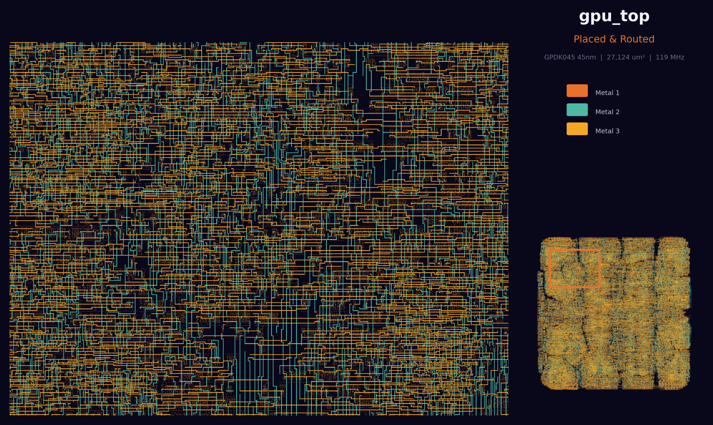
</p>

<details>
<summary>More layout views</summary>

| View | Description |
|------|-------------|
| 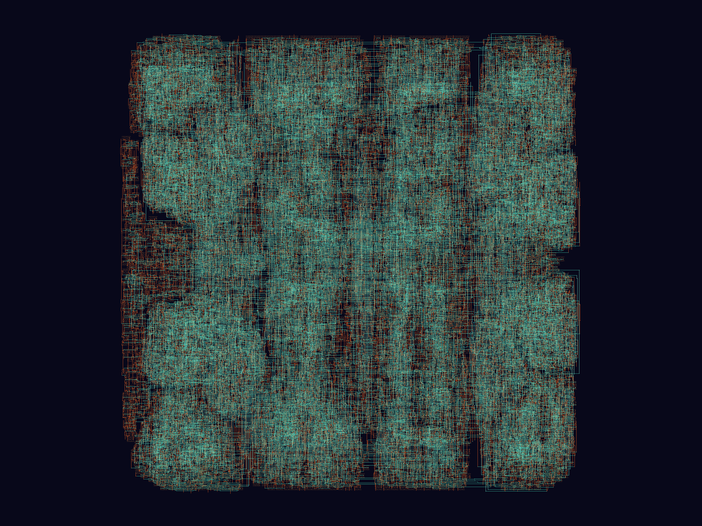 | Full chip — cells (teal) and routing (red/orange) |
| 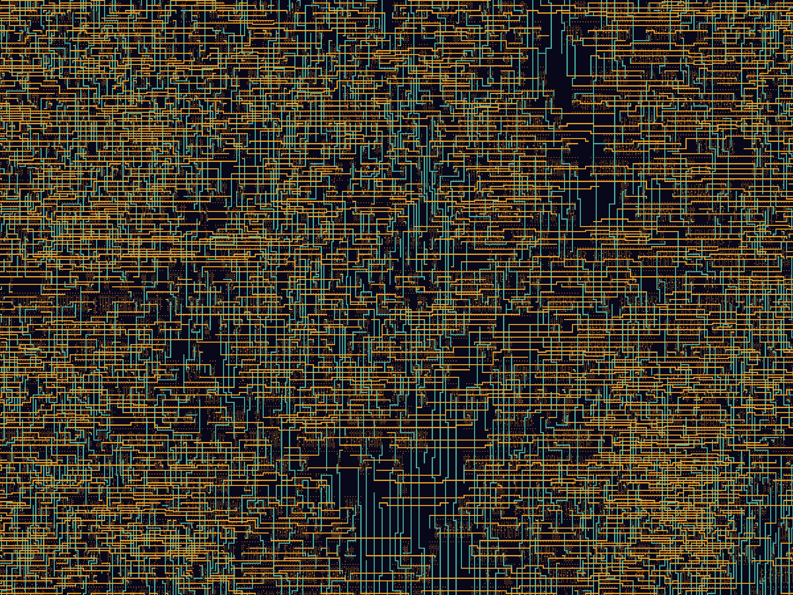 | Zoomed routing detail — metal 1/2/3 visible |
| 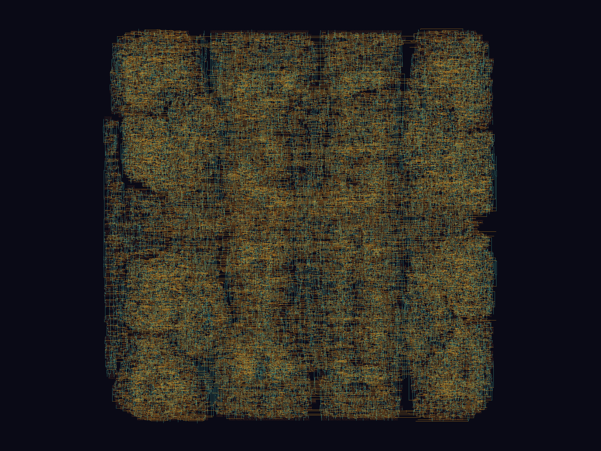 | Metal 1 + Metal 2 + Metal 3 layers |
| 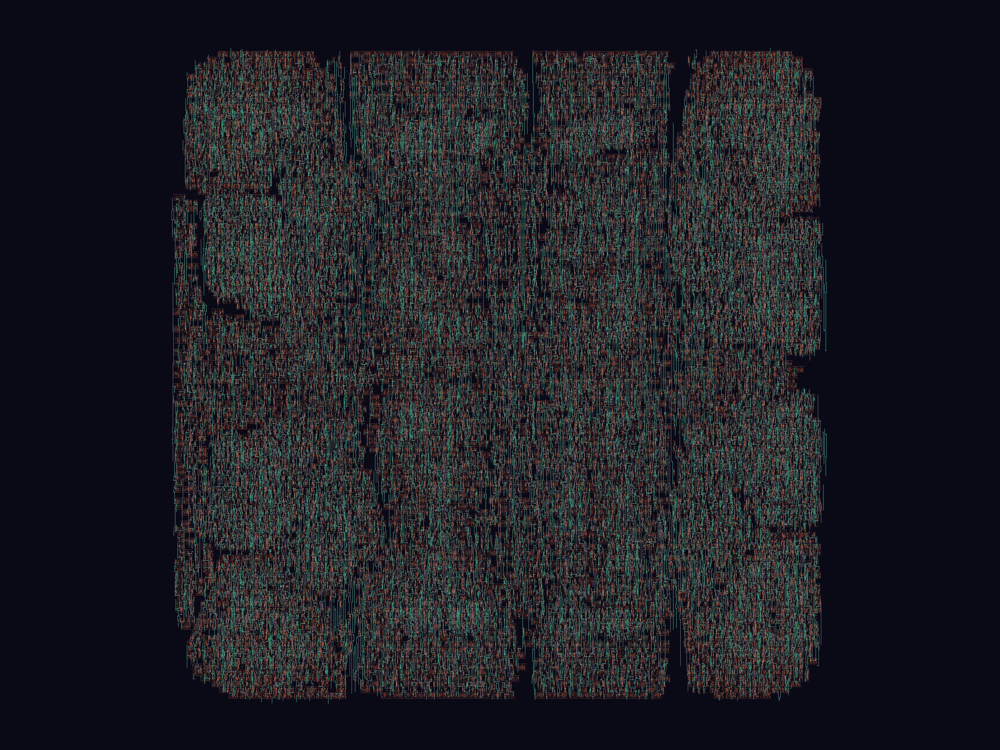 | Poly + Metal 1 + Metal 2 — cell structure visible |
| 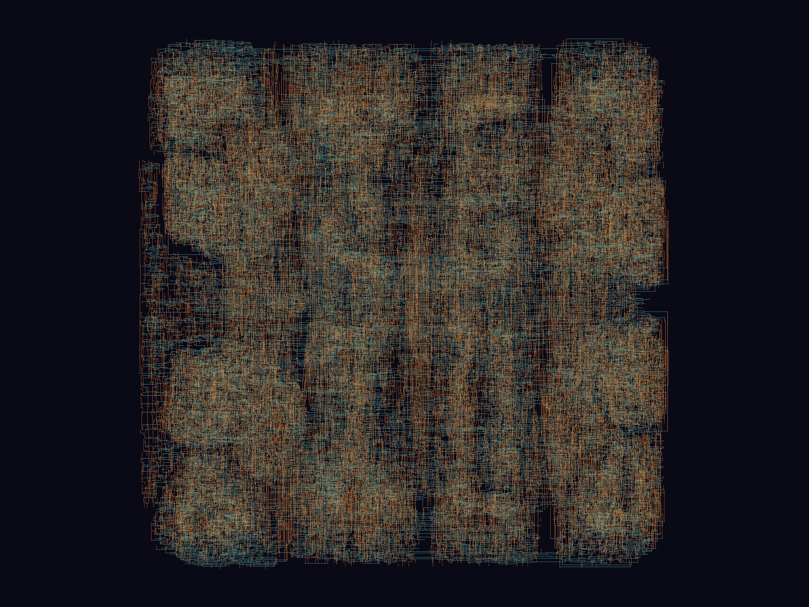 | Routing metal only |
| 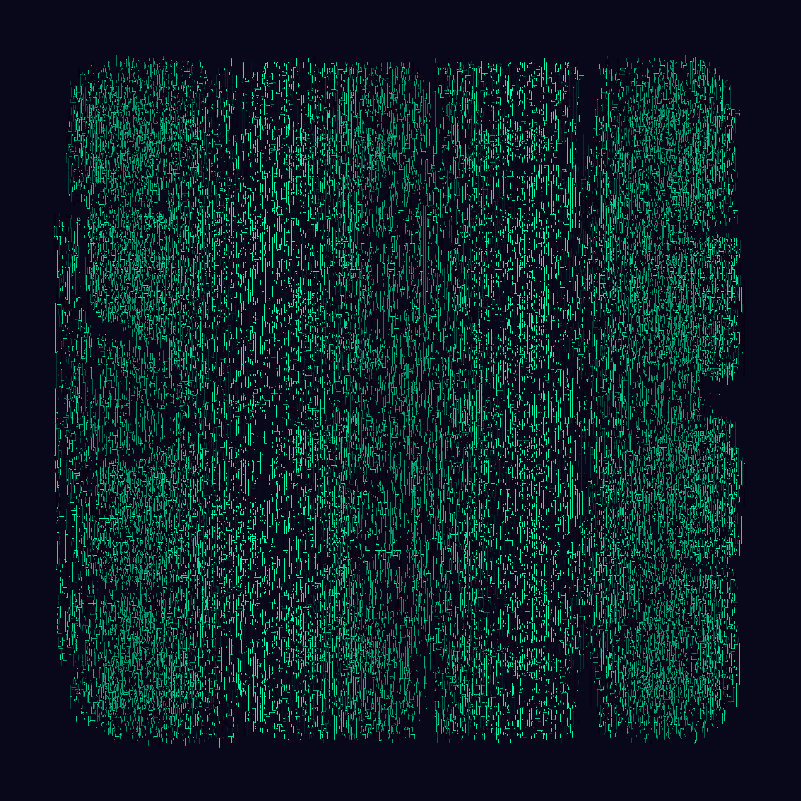 | Vertical routing emphasis |
| 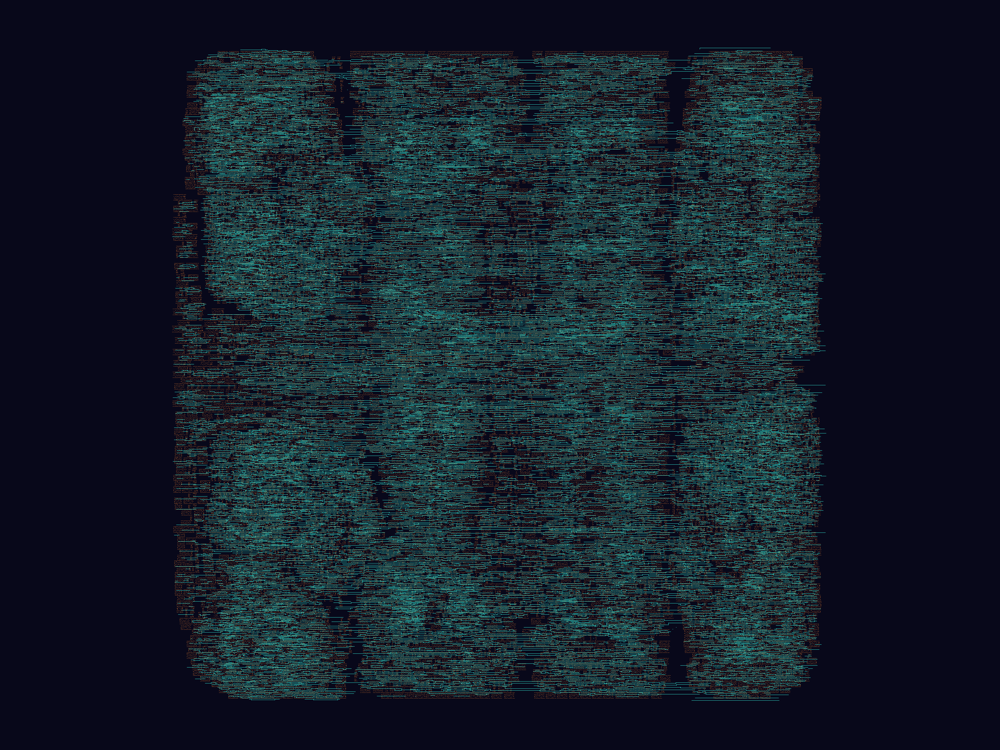 | Horizontal routing emphasis |
| 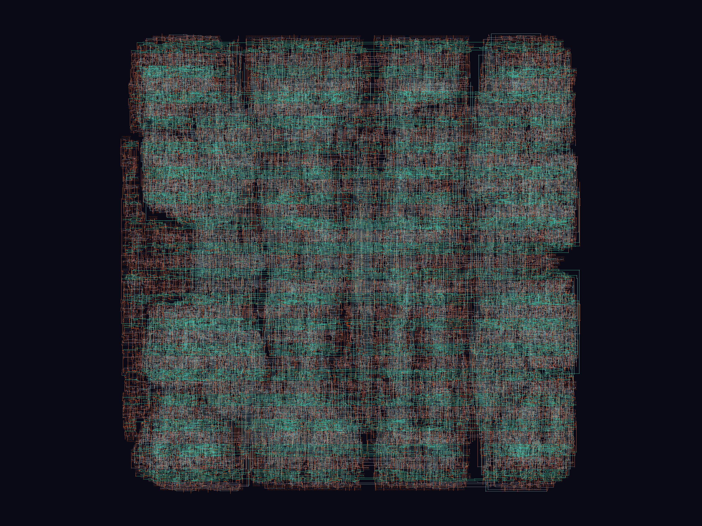 | Four-layer composite |
| 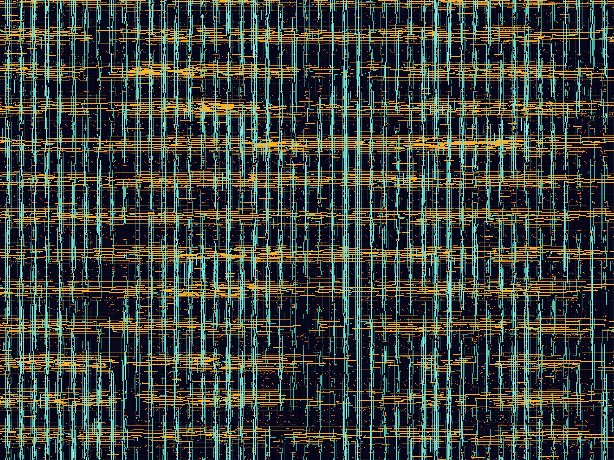 | Center region detail |

</details>

## GPU Architecture

A minimal SIMD processor:

- **4 parallel lanes**: each lane has a 32-bit integer ALU with multiply
- **8 vector registers**: 4 lanes x 32 bits x 8 registers
- **13-instruction ISA**: arithmetic (`VADD`, `VSUB`, `VMUL`), logic (`VAND`, `VOR`, `VXOR`), shifts (`VSHL`, `VSHR`), compares (`VCMPEQ`, `VCMPLT`), memory (`VLOAD`, `VSTORE`), control (`BRA`)
- **Uniform branching**: predicate register `p0` drives branch decisions across all lanes
- **Scalarized memory**: vector loads/stores decompose into per-lane transactions

Eight main Verilog modules implement the SIMD target:

| Module | Role |
|--------|------|
| `gpu_top` | Top-level integration |
| `gpu_control` | Fetch, execute, branch, stall |
| `gpu_decoder` | 32-bit instruction decode |
| `lane_alu32` | Single-lane 32-bit ALU |
| `lane_cluster4` | 4-lane SIMD execution cluster |
| `vector_regfile` | 8x4-lanex32-bit register file |
| `load_store_unit` | Vector memory sequencing |
| `predicate_unit` | Predicate reduction for branches |

Full ISA encoding and module details live in `docs/architecture.md`.

## Repo Structure

```text
torch2rtl/
├── rtl/                  # 8 synthesizable Verilog modules + scalar variant
├── tb/                   # self-checking testbenches
├── constraints/          # SDC files
├── tools/                # compiler and assembler
├── demo/                 # checked-in MLP assembly, data image, and references
└── docs/                 # architecture notes, benchmark, report bundles
```

## Known Limitations

- **The checked-in benchmark now includes CTS and SPEF-backed PrimeTime runs, but not full signoff closure.** The published slacks are negative under propagated-clock extracted STA, which is useful evidence, not a closure claim.
- **Standalone Quantus extraction is still brittle on this design.** The published timing path falls back to Innovus `rcOut` SPEF when direct Quantus extraction fails, and `summary.txt` records that fallback explicitly.
- **GPDK045 DRC is not clean.** Pegasus still reports the standing baseline seen elsewhere in this project.
- **Integer-only datapath.** The v1 ISA has no floating-point support.
- **Narrow compiler scope.** The validated compiler path covers quantized two-layer MLP shapes where `inputs` and `hidden` are divisible by `4`.
- **CMC Cloud required** for the validated EDA backend path. The Python tools and RTL can be reused elsewhere, but the published backend evidence depends on `/CMC/...`.

## For AI Agents

`CLAUDE.md` is the repo bootstrap. It summarizes layout, workflow, benchmark context, and the `eda-pilot` handoff.

## License

MIT. See [LICENSE](LICENSE).
